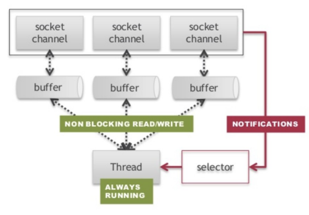
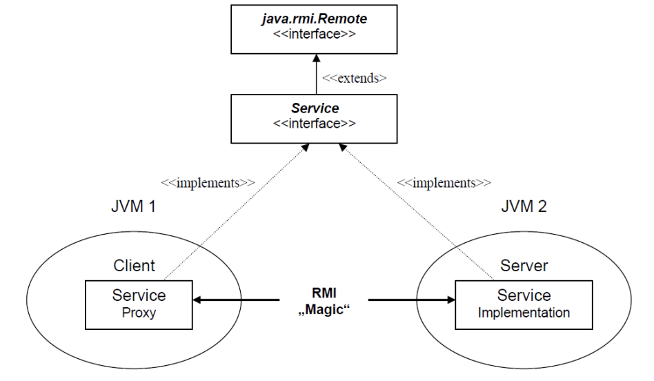

# **Relazione Progetto Reti 2021/22**
## **Marco Marinò (596440)**

### **Come eseguire il Server**
Posizionarsi nella cartella src ed eseguire:
```bash
javac -cp .:../lib/gson-2.8.9.jar *.java
```
e poi:
```bash
java -cp .:../lib/gson-2.8.9.jar ServerMain
```

### **Come eseguire il Client**
Posizionarsi nella cartella src ed eseguire:
```bash
javac -cp .:../lib/gson-2.8.9.jar *.java
```
e poi:
```bash
java -cp .:../lib/gson-2.8.9.jar ClientMain
```

### **Introduzione**
Al fine di ridurre thread switching overhead e uso di risorse per thread diversi ho deciso di basare l'architettura server su java NIO (non-blocking) associata ad un cached threadpool. Vedremo più avanti le classi per i tipi di thread associati, ma in breve, vi sono tipi di thread associati alla gestione delle richieste, gestione delle rispose e calcolo delle ricompense e autosaving sulle strutture JSON.



### **Main flow e Classi Thread**
Il flow parte quando una key è acceptable, il che vuol dire che un client vuole connettersi al server. Il client viene accettato e la chiave ad esso associata viene rimessa nel selector. D'ora in poi la chiave sbloccherà la select ogni qualvolta che è possibile leggere dal canale associato alla chiave. Qui, la chiave viene temporeanamente rimossa dal selector in modo che la select non si risbloccherà per colpa della chiave presa in considerazione. Ho pensato di far entrare qui in gioco i thread pool creando una classe **Reader Thread** la quale si occuperà di:

- leggere la richiesta raw dal buffer
- suddividere la richiesta in campi (per esempio il campo 0 è l'operazione che il client vuole fare)
- multiplexare le azioni in base al campo operation
- salvare la response come attachment della chiave

In questo modo il thread che gestisce le connessioni può andare avanti "in parallelo" per accettare altre connessioni, delegare thread lettori e scrittori.

#### **Reader/Writer Thread, come funzionano**
Il Reader Thread estende Runnable e rappresenta il cuore per la gestione delle richieste TCP che arrivano dal client. Introduco una nuova classe che mi è stata di supporto, prima di addentrarmi nel cuore del Reder Thread

##### **NIOHelper**
In questo progetto ho creato una classe chiamata NIOHelper che contiene due metodi:

- readRequest
- writeResponse

Ognuno raggruppa le azioni di lettura dal buffer e di scrittura. Per quanto riguarda la comunicazione ho pensato fosse interessante ,in fase di scrittura, scrivere prima un intero che rappresenta la grandezza in byte del messaggio (payload) che voglio inviare, in modo che proprio in fase di lettura io possa allocare la quantità precisa per il byteBuffer evitando così di leggere "sporcizia" dal buffer. Potrebbe essere banale, ma raggruppare queste istruzioni in due funzioni statiche mi è stato d'aiuto per semplificare la complessa comunicazione che Java NIO comporta.

Ritorniamo ora al Reader Thread. Nel momento in cui si passa per il costruttore si nota come ho deciso già di allocare come attachment un byte buffer da 32K che contiene la response, la quale verrà data in paso al thread scrittore. Secondo la specifica del progetto, le richieste hanno un formato comune ovvero: *operation options*. Perciò la prima cosa che ho fatto è innanzitutto ottenere sottoforma di stringa la richiesta sfruttando la readRequest di NIOHelper e successivamente di suddividere la richiesta usando come separatore uno spazio vuoto. In questo modo mi è risultato facile smistare gli handler delle operazioni in base al primo elemento della lista risultante dallo split. *Disclaimer:* in questa relazione menzionerò gli handler più interessanti, tralasciando quelli più "scontati" (menziono follow, senza menzionare unfollow sapendo che la logica dietro è la stessa). Come appena accennato inizierò a descrivere il funzionamento di ogni comando che il Reader Thread gestisce, tenendo conto che ulteriori dettagli sono scritti nel codice.

- ```performLogin:``` iniziale controllo degli argomenti (qui si aprirebbe un punto di discussione: avrei preferito fare i controlli lato client, ma per questioni di tempo non ho potuto migliorare questa parte e generalizzando avrei potuto applicare meglio il Single Responsibility Principle) e successivamente blocco lo storageService (classe che contiene le tre strutture dati portanti, ovvero, storage per gli utenti, posts e loggedUsers, ne parlerò in dettaglio più avanti) in quanto mi servono due strutture insieme quali lo storage per gli utenti e loggedUsers per poter controllare se l'utente è già loggato nella macchina con cui fa il login o in un'altra. Qui faccio un controllo dando in pasto alla funzione hash la password e confrontandola con quella presente nella struttura storage (caricata in RAM). C'è da notare come in questo metodo venga chiamata anche getFollowersListOutput. Questa funzione si occupa di andare a ripescare i follower una volta che è stato verificato che il login sia ok, e di inviarli con i rispettivi tags separati da doppio slash. In questa maniera il login non ritorna solo una conferma al client, ma anche una lista di follower che effettivamente ha. Questa cosa mi è servita per poter mantenere nel client la lista dei follower, altrimenti lato client sarebbero risultati solamente i follower che man mano si aggiungono con il sistema di notifica rpc;
- ```performLogout:``` controllo se il socket associato all'utente loggato in loggedUsers è lo stesso del socket associato alla chiave che si sta considerando, se così non è allora vuol dire che l'utente presso quella macchina non ha ancora fatto il login;
- ```metodi "routers":``` sono quei metodi il cui primo campo ("operation") è uguale, come list o show, ma cambia l'opzione successiva, in caso di list abbiamo list users, list following e list followers e così anche per show post e show feed. Questi metodi, controllano anche se l'utente connesso è loggato. Tutti i metodi che richiedono che l'utente sia loggato hanno sempre una funzione di controllo che restituisce un booleano (**isUserLogged** => controlla se esiste una occorrenza del socket corrente in loggedUsers);
- ```listUsers:``` per questo metodo non c'è molto da dire, però ho sincronizzato lo storage in modo tale da leggere in maniera safe la lista degli utenti che hanno gli stessi tag dell'utente. Il funzionamento di questo metodo è quasi analogo a list following;
- ```performFollow/Unfollow:``` controllo se l'utente è loggato, controllo se l'utente specificato esiste nella rete sociale. Se si, aggiungo nella lista dei following dell'utente loggato (a meno che non esista già) il follower in parametro e aggiungo nella lista dei follower dell'utente in parametro, l'utente loggato, ovvero, colui che fa la richiesta di follow. Inoltre chiamo il metodo updateNewFollower per andare a notificare il follow all'utente in parametro (Analogamente, faccio la unfollow);
- ```performAddPost:``` solito controllo per vedere se l'utente è loggato. Questa volta accade qualcosa di diverso, ovvero, splitto la richiesta con le virgolette in modo da estrarre titolo e contenuto del post che l'utente vuole aggiungere, qui non uso nessun synchronized block in quanto uso una concurrent hash map per le strutture dati principali (come posts);
- ```performWalletOperation:``` operazione che gestisce comandi wallet e wallet btc, in particolare parlo di wallet btc perché wallet si tratta solamente di leggere la total compensation dell'utente e di leggere la lista delle transazioni, il tutto ovviamente sincronizzando lo storage (utenti, so che il nome storage non è il massimo). wallet btc manderà una richiesta URL al sito di random.org richiedendo in query un numero compreso tra 0 e 1 che verrà poi moltiplicato con la total compensation per poter simulare il valore in bitcoin del wallet corrente;
- ```altri metodi:``` gli altri metodi sono piuttosto simili, ho preferito aggiungere in relazione questi perchè ritengo che siano quelli più diretti;

Una volta che il thread lettore ha interpretato ed eseguito l'azione richiesta dal client, ri-registra la chiave, associata alla richiesta appena eseguita, come OP_WRITE. In questo modo il selector thread noterà che vi è una chiave in scrittura e, analogamente con le chiavi pronte in lettura, delega un **Writer Thread** che invierà la risposta salvata nell'attachment della chiave. Anche in questo caso la chiave verrà temporeanamente tolta dal selettore. Il thread scrittore, inoltre, chiuderà la connessione in caso di chiusura del client, altrimenti re-inserisce la chiave nel selettore in OP_READ, in modo che il selector thread possa riascoltare eventuali ulteriori richieste da parte del client preso in considerazione.

### **Breve sommario sulle strutture dati**
Come detto in precedenza, vi sono tre strutture dati principali:

```java
    public Map<String, User> storage;
    public Map<String, Post> posts;
    public Map<String, Socket> loggedUsers = new ConcurrentHashMap<>();
```

Le prime due vengono inizializzate dal ```PersistentOperator```, ovvero, una classe che si occupa di leggere e scrivere dai JSON perché storage e posts vengono inizializzate a partire da dati presenti sul disco fisso. ```storage``` è una mappa la cui chiave è lo username e il valore è un oggetto ```User```. Uno User ha come attributi lo username, la password cifrata con ```SHA-256```, tags, followers, id dei post (questo perché i post vengono salvati nell'altra struttura dati ```posts``` e quindi in un altro JSON), followings, compenso totale (da curatore o da autore) e una lista di transazioni composte da quantità di wincoin e timestamp. Un post è composto da id, titolo, contenuto, autore, voti positivi e negativi, id di post che hanno fatto rewin su di esso, commenti visti come lista di coppie username e contenuto, poi ancora, voti positivi e negativi e, infine, una lista di commenti recenti utili per il calcolo delle ricompense da parte del **RewardCalculator** thread che si occuperà di svuotarli alla fine del calcolo per ogni post e due liste per mantenere i recenti voti positivi e negativi (sui negativi non serve effettivamente).

### **Registrazione con RMI**
Secondo la specifica del progetto, la fase di registrazione è stata implementata mediante RMI: l'interfaccia "SignInService" rappresenta lo stub che verrà esportato e pubblicato nel registry associato alla porta specifica RMI. La classe che implementa "SignInService" è anche la classe che contiene le tre strutture dati principali (di cui parleremo meglio in seguito). Come detto in precedenza questa classe implementa il metodo register il quale si occuperà di controllare se i tag sono stati inseriti, che la password sia sicura e che lo username inserito sia non presente nello storage (struttura dati che contiene gli utenti). Da qui si evince che la chiave primaria associata ad ogni utente è proprio l'username quindi non è possibile avere due utenti con lo stesso username. Lato client, invece, esiste la classe SignInHandler che si occupa di prendere una reference della registry RMI e di creare un nuovo oggetto SignInService che gli servirà per poter chiamare la registrazione (di fatto al costruttore gli vengono passati username, password e tags).



### **RMI Callbacks per le notifiche**
La responsabilità dell'implementazione di un sistema di notifica direzionato (client A segue/smette di seguire client B) la detiene la classe ServerAsyncImpl che estente ServerAsyncInterface. Questa classe contiene:

- una lista di tutti i client registrati alle callback
- funzioni per poter far registrare e disiscrivere client
- callback follow
- callback unfollow

Nelle funzioni doFollow/doUnfollowCallback si iterano i clients e gli si notificano un follow unfollow, poi saranno i client a ignorare le notifiche qualora non fossero i receiver di quella notifica (la classe NotifyEventImpl lato client). 

### **Calcolo delle ricompense**
Il calcolo delle ricompense avviene secondo quanto scritto dalla seguente formula:


Nel file di configurazione del server viene specificato un intervallo tale per cui ogni volta il thread che fa il calcolo delle ricompense scorre i post bloccando lo storageService (insieme delle strutture dati) e controllando i commenti recenti e i voti positivi recenti. Dal file di configurazione viene letto anchhe la quantità in percentuale di guadagno netto dell'autore del post; il resto della percentuale viene diviso per il numero dei curatori, ovvero, tutti coloro che hanno recentemente commentato o messo voto positivo al post. Inoltre, ho usato un set per evitare che un utente possa guadagnare da due o più commenti fatti nell'intervallo. Infine invio il datagramma UDP al client di conferma del fatto che le ricompense siano state ricalcolate.

### Note Finali
Un mark finale ha come punto di discussione il fatto di riscrivere il json ogni volta da capo, un possibile spunto potrebbe essere cercare di capire per esempio come funziona Google Firebase (se anche lui riscrive il json per ogni modifica ad un campo). Ulteriori miglioramenti potrebbero essere fatti sul fatto di serializzare campo per campo nel json in modo da evitare overflow di stringhe, oppure mandare come handshake le informazioni relative agli indirizzi/porta RMI e UDP. Arricchire il progetto di custom exceptions e fare unit testing sistematici.